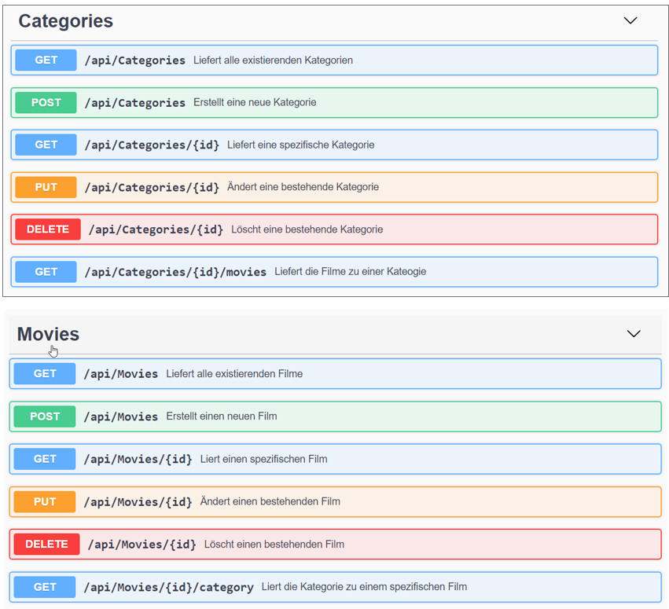

# Movie Manager WebApi (Teil 2)

## Lernziele

* EntityFramework Core
* UnitOfWork-Muster
* WebApi
* REST (GET, POST, PUT, DELETE)

## Core

Die Entitätsklassen sind bereits angelegt. Auch die Annotationen zur Definition (inkl. der Migrationen) der Datenbank sind bereits implementiert.

## Klassendiagramm

Die Klasse `Movie` verwaltet die Informationen zu einem konkreten Film inkl. dem Verweis auf die Kategorie (`Category`) des Films.


Im Core-Layer sind die Contracts für die Repositories bedarfsgerecht zu erweitern. Die leeren Interfaces sind bereits vorgegeben.

## Persistierung

Die Persistierung besteht bereits und ist im Projekt `MovieManager.Persistence` implementiert.

## Import

Die Logik zum Einlesen der Movies (inkl. Categories) ist bereits im Projekt `MovieManager.ImportConsole` implementiert.

## WebApi

Implementieren Sie zur bestehenden Persistenzschicht eine WebApi analog zum [Live-Coding](https://github.com/jfuerlinger/csharp_livecoding_ef_uow_webapi-part2/tree/termin/2020-04-30).

Ihre WebApi muss folgende Actions implementieren:



Verwenden Sie zum Testen die Visual Studio Code Extension [REST Client](https://marketplace.visualstudio.com/items?itemName=humao.rest-client).

Verwenden Sie DTOs (DataTransferObjects) um bei lesenden Operationen die Daten dem Aufrufer zurückzuliefern bzw. bei schreibenden Operationen entgegen zu nehmen.

## Validierung

Verwenden Sie dazu bereits im Namespace System.Data.DataAnnotations existierende Attribute bzw. Implementieren Sie im Bedarfsfall eigene Validierungsattribute.

Folgende Regeln müssen überprüft werden:

| Entität  |   Attribut   | Regel                                                                  |
|:---------|:------------:|:-----------------------------------------------------------------------|
| Movie    |    Title     | Pflichtfeld; Länge zw. 3 und 100 Zeichen                               |
| Movie    |     Year     | Wertebereich zw. 1900 und 2099                                         |
| Movie    |  Dureation   | `ClassicMovieMaxDuration` (Erklärung siehe unten); Werte zw. 0 und 300 |
| Movie    |  CategoryId  | Pflichtfeld                                                            |
| Category | CategoryName | Pflichtfeld                                                            |


### ClassicMovieMaxDuration

Implementieren Sie ein benutzerdefiniertes Validierungsattribut, welches sicherstellt, dass Filme vor 1950 nur eine maximale Länge von 60 Minuten aufweisen dürfen. 

Diese beiden Werte müssen konfigurierbar sein!

**Verwendung:**

```cs
[ClassicMovieMaxDuration(isClassicMovieUntilYear: 1950, maxDurationForClassicMovie: 60)]
public int Duration { get; set; } //in Minuten
```